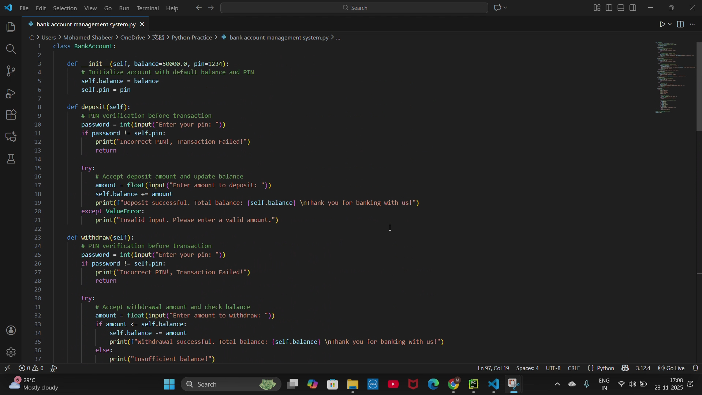

# Console-Banking-System
The Console Banking System is a simple Python-based banking application built using Python that runs in the terminal. The project demonstrates OOP concepts. This allows users to perform simple banking operations, showcasing how real-world banking logic can be implemented using Python.

# Console Banking System

A simple and beginner-friendly Python project that simulates basic banking operations through a console interface. This mini-project demonstrates essential **Object-Oriented Programming (OOP)** concepts such as classes, objects, methods, and encapsulation.

---

## 📌 Features
- Deposit money  
- Withdraw funds  
- Check account balance  
- Change PIN securely  
- PIN verification before accessing the menu  
- Loop-based menu until the user chooses to exit  
- Simple and clean console interface  

---

## 🛠️ Technologies Used
- **Python 3**
- Console / Terminal I/O  
- Object-Oriented Programming  

---

## 📸 Screenshots  
(Add your 3 images here)

```



```

---

## 📘 How It Works
- The user enters their PIN for verification.  
- After successful authentication, the main menu appears.  
- The user can choose from deposit, withdraw, balance inquiry, or PIN change.  
- After completing tasks, the user can exit, and the system displays a thank-you message.

---

## 🎯 Learning Outcomes
This project helps in understanding:
- Class creation and object usage  
- Method implementation  
- User input handling  
- Menu-driven console applications  
- Basic validation and account security logic  

---

## 📜 License
This project is licensed under the **MIT License**.  
You are free to use, modify, and distribute this project with proper attribution.

## 📜 License
This project is open-source under the [MIT License](https://opensource.org/licenses/MIT).

